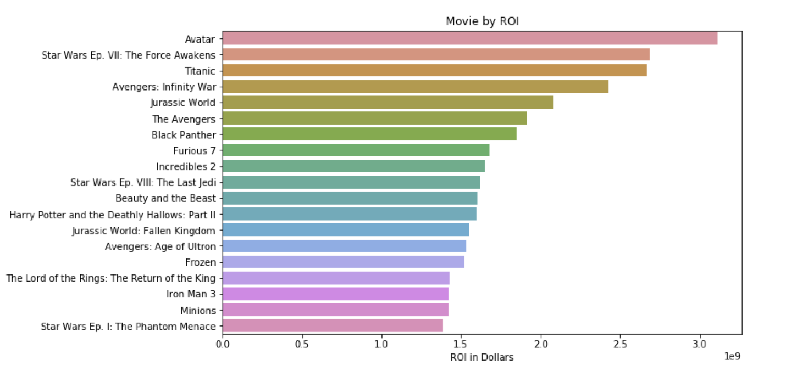
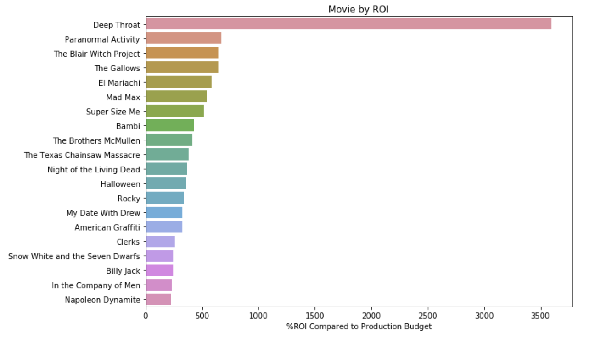
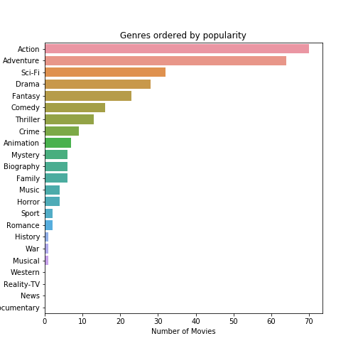
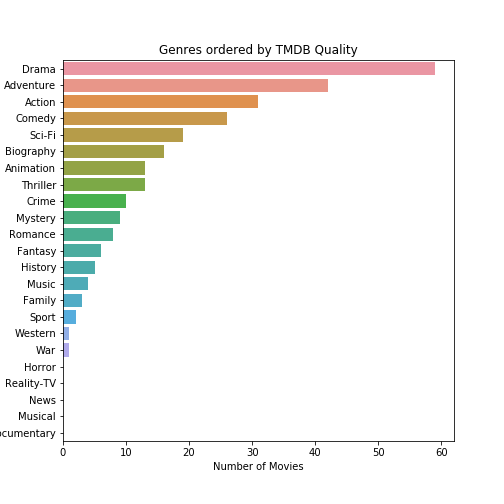
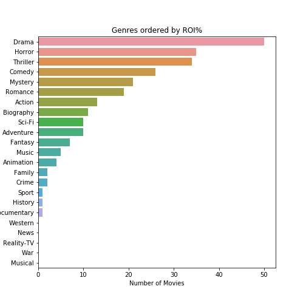

# Movie Data Analysis

The purpose of this project is to analyze data from a variety of sources to create a slate of content produced by a new company entering the video streaming marketplace.

### The Data
The data used for the project was pulled from these various sources:
- IMDB - The International Movie Database
- TMDB - The Movie Database
- Movie Production Budget and Box Office Gross Data

This project is unconcerned with critical failures, but rather what makes a recipe for success? Therefore, I will only focus on data from films with the highest audience vote counts on both IMDB and TMDB, to avoid massive outliers.

## What Makes a Streaming Company Succesful?
Any new streaming service will need a mixture of both original and licensed content covering a multitude of genres and styles. Because of this, unless the company is targeting a niche market, all original content should try to reach as broad an audience as possible. Therefore this project will ask the following questions:

- Does Production Budget affect Popularity?
- What Genres of film are most popular? Are the best financial investment? Have the highest quality?
- What actors, producers, directors and writers should you hire to create this content?

This project will answer all of the above with recommendations for a new streaming service. 

# Analysis

## Return on Investment

I chose Return on Investment as one of the major metrics for a few reasons. For a film to gain the most possible profit it would require the necessary intersection of quality filmmaking as well as general popularity. Looking only at box office gross could be deeply misguided as the film 'Dark Phoenix' outperformed the film 'The Blair Witch Project' by a few million, but because 'Dark Phoenix cost over 200 million dollars to make, it lost a substantial amount of money while, as you will see, The Blair Witch Project is the second most successful film of all time when considering Return on Investment as a percentage of the original budget.

## Why?
For streaming movies, it is difficult to measure the value a single film brings to a streaming service's portfolio because no streaming company publishes their viewing data. However, general popularity of a film is a good indicator of an audience's interest in paying more money for another streaming service. ROI is the best monetary indicator of popularity.

Already we can see that the movies that create the most profit tend to be big budget action adventure movies. Avatar, famously the most expensive movie of all time, is also the most profitable (a bold bet). However, we can see some interesting patterns that emerge when we consider other metrics.

## Return on Investment as a Percentage

When we divide the ROI of a movie by its original budget, we find a completely different and fascinating list of films. Instead of being large budget action films, they are cheaper, smaller horror movies (if we ignore the obvious outlier of 'Deep Throat'). Avatar, while record breakingly successful, made back 100% of its budget in profits. Comoparably, Paranormal Activity made over 600% of its budget.

## Why is this important?
Any streaming service needs a breadth of content. Spending all of your money on a second Avatar would be unwise. Cheaper movies can also be popular, though that is not always the case. Some small budget movies can find massive popularity and essential cult status.

This is a linear regression charting the relationship between production budget (in dollars) and TMDB popularity score. As you can see there is a positive, linear relationship between the two metrics. This makes sense, as marketing is a large part of the Production Budget. Also, popular actors tend to require more money and, for many years, most films are sold on the talent on screen, hence the higher cost.

Interestingly, there is a vertical cluster at the 200 Million Dollar range. 200M has become the standard budget for a summer blockbuster movie, so you can see the popularity of those films varies wildly.

## Question 2 - What Genres Should We Focus On?

The easiest way to identify most movies is by their genre. Genres are both an artistic style as well as a marketing tool. Of the films analyzed, the genres were assigned by IMDB, and most films have multiple genres. This section seeks to ask the following questions:

1. What genre(s) produce the greatest ROI?
2. What genre(s) produce the greatest ROI%?
3. What genre(s) have the highest critical praise?
4. What genre(s) are the most popular?

While similar, all three questions encourage a very different style of content that could increase the success of a new streaming company. But first, more data cleaning

## Genre by Popularity
As you can see, Action/Adventure movies tend to return the highest profits. These are going to be the blockbuster films of the streaming service. An action/adventure science fiction film, like any of the Marvel movies, or The Matrix, have proven to be massively popular with audiences, hence their profitable nature

## Genre by Quality
Movies are sometimes described a 'prestige' meaning that, while they might not sell the most tickets at the movieplex, they stand in good ground with critics. A streaming service should have a fair share of blockbuster popular titles, but it should also have so genuine quality work as well. While Action/Adventures still rank high on this metric, Drama is the most important genre to woo critics.

## Genre by ROI%
Below you see genres ordered by how successful a movie was against its original budget. These films have the greatest difference between their production budget and their popularity. Films like these should require very little money, comparatively, but could draw large audiences. Similar to 'Quality', Dramas are the highest rated here. This makes sense because most 'Oscar' films tend to have low budgets (compared to, say, the Fast and the Furious films) and high cultural value because they have been nominated for awards. 

We can also see that Horror and Thriller are the next two genres. These films tend to be audience pleasers and can be made extremely cheaply. The Blair Witch Project was the 2nd most successful film of all time until Paranormal Activity, a similarly cheap and effective horror film, took its place.

## Question 3 - Who should we hire?

The success of any movie is determined by the creative team behind it. In general, the most marketable people working on a film are the following:

1. Actors
2. Directors
3. Writers
4. Producers

Every one of these roles is essential to the final product. Actors draw crowds and a fanbase. Directors are in charge of the artistic vision of the piece. Writers have to tell a complete and efficient story. And producers have to put it all together in a package that people love. 

Below you can see the best crew to hire for a cheap movie that gives the greatest return on investment:

For more examples please see the Movie_Analysis Jupyter Notebook.

# Conclusions

It is clear that any successful streaming service needs a wealth of content when it goes live, both original creations and licensed films from other studios. The following conclusions will address each metric we have analyzed and give suggestions for production.

## Conclusion Number 1 - Popularity

First and foremost, movies need to be popular if they expect to make a mark on the streaming market. From the genre analysis, the most popular movies tend to:

- Be Action/Adventure Science Fiction Movies
- Have a high budget (typically greater than 200 million dollars)

Below is a list of directors, actors, producers and writers who have proven to create popular work.

- Actors - Alfie Allen (Game of Thrones), Michael Nyquist, (John Wick), Dafne Keen (His Dark Materials)
- Directors - Chad Stahelski (Spiderman: Into the Spider-Verse) David Leitch (Deadpool 2)
- Writers - Derek Kolstad (John Wick 3: Parabellum), Nicole Perlman (Guardians of the Galaxy)
- Producers - Mike Witherill (John Wick), Steve Kloves (Fantastic Beasts)

## Conclusion 2 - Return on Investment with a Small Budget

Some of the most popular films of all time were also surprisingly cheap. While action adventure films will be the service's big ticket property, the studio should also focus resources on making popular small budget films. These films should be from one or many of the following genres:

- Drama
- Horror
- Thriller

Below you will find a list of actors, directors and producers based on their career's return on investment as a percentage of initial production budget:

- Actors - Micah Sloat (Paranormal Activity), Molly Ephraim (Perry Mason), Allison Williams (Get Out)
- Directors - Tod Williams (Paranormal Activity 2), Jordan Peale (Us)
- Writers - Michael R. Perry (Law and Order SVU), Tom Pabst (Paranormal Activity 2)
- Producers - Edward H. Hamm Jr. (Antebellum), Adele Romanski (Moonlight)

## Conclusion 3 - Prestige Films

The last category is one that rounds out a healthy slate of films is prestige movies (typically dramas). These movies and shows tend to garner the most attention from movie critics and award shows.

Below you will find the top writers, actors, directors and producers based on their career's perceived quality by the viewing audience:

- Actors - Mackenzie Foy (The Queen), Paul Reiser (Mad About You), Melissa Benoist (Whiplash)
- Directors - Christopher Nolan (Dunkirk), Adrian Molina (Coco)
- Writers - Jonathan Nolan (Westworld), Matthew Aldrich (Coco)
- Producers - Lynda Obst (Interstellar), Emma Thomas (Inception)

# Areas of Further Study

My next goal is to attempt to analyze current streaming libraries on each service's platform to determine what percentage of their overall content offering belongs to the categories listed above. I'm also interested in trying to determine the success of certain tv shows based on the number of seasons it receives from the studio and how much their budget increases season over season. Data on streaming success is notoriously difficult to ascertain, but we can draw conclusions about audience numbers based on how willing major streaming studios are to throw money at an intellectual property.